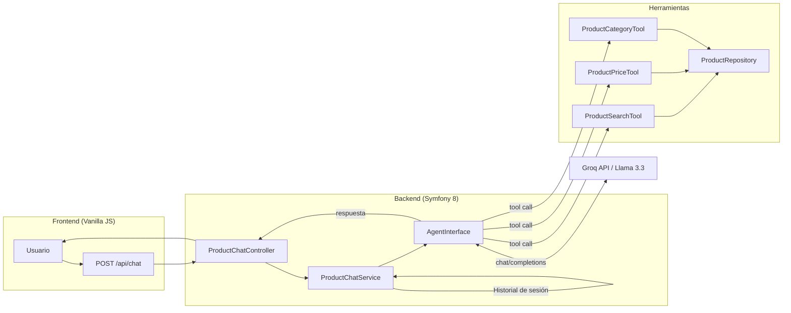

# Symfony AI Product Agent

Código fuente del artículo **"Construyendo un Agente de IA con Symfony"**.

Un agente conversacional para una tienda en línea ficticia, construido con Symfony 8, el componente Symfony AI y el modelo Llama 3.3 a través de la API de Groq. 

**Características principales:**
- **Streaming en tiempo real:** Implementado con Server-Sent Events (SSE) para una respuesta instantánea.
- **Tools dinámicas:** Búsqueda, precios y categorías integradas con el agente.
- **Historial persistente:** Gestión de contexto mediante sesiones de Symfony.
- **Frontend nativo:** Interfaz construida con Vanilla JS y CSS moderno, sin frameworks pesados.

---

## Documentación Detallada

Puedes encontrar guías paso a paso de la implementación en los siguientes artículos:

1.  **[Symfony AI en la práctica: agentes, tools y modelos gratuitos desde PHP](https://juredev.com/blog/2026/04/symfony-ai-agentes-tools-php/)**
2.  **[Symfony AI en la práctica (II): chat conversacional con historial, múltiples tools y Vanilla JS](https://juredev.com/blog/2026/04/symfony-ai-practica-chat-con-historial-tools-y-vanilla-js/)
3.  **[Symfony AI en la práctica (III): Streaming real con SSE y gestión de Tools anidadas](https://juredev.com/blog/2026/04/symfony-ai-practica-iii-streaming-con-sse-gestion-de-tools-anidadas/)**

---

## Requisitos

- PHP 8.3+
- Composer
- Una clave API gratuita de [Groq](https://console.groq.com/)

---

## Instalación

```bash
git clone https://github.com/tu-usuario/symfony-ai-product-agent.git
cd symfony-ai-product-agent

composer install

cp .env .env.local
# Añadir en .env.local:
# GROQ_API_KEY=gsk_tu_clave_aqui

symfony server:start
```

Abrir en el navegador: `http://127.0.0.1:8000/chat-demo`

---

## Estructura

```
src/
├── AI/
│   ├── ProductChatService.php      # Gestiona el historial de sesión y construye el MessageBag
│   └── Tool/
│       ├── ProductSearchTool.php   # Herramienta: busca productos por nombre (paginado)
│       ├── ProductPriceTool.php    # Herramienta: devuelve el precio de un SKU concreto
│       └── ProductCategoryTool.php # Herramienta: devuelve las categorías disponibles
├── Controller/
│   └── ProductChatController.php   # Endpoint POST /api/chat
├── Entity/
│   └── Product.php
└── Repository/
    └── ProductRepository.php       # Catálogo mock: 20 productos, 5 por categoría

templates/chat/demo.html.twig       # Interfaz del chat
config/packages/ai.yaml             # Configuración del agente y las herramientas
```

---

## Herramientas del Agente

| Nombre | Parámetros | Descripción |
|---|---|---|
| `search` | `query` (string), `page` (string, por defecto "1") | Busca productos por nombre o categoría. Devuelve 3 resultados por página. |
| `price` | `id` (string) | Devuelve el precio de un producto a partir de su SKU. |
| `categories` | - | Devuelve la lista de categorías disponibles en la tienda. |

---

## Diagrama de Arquitectura



---

## Licencia

MIT
